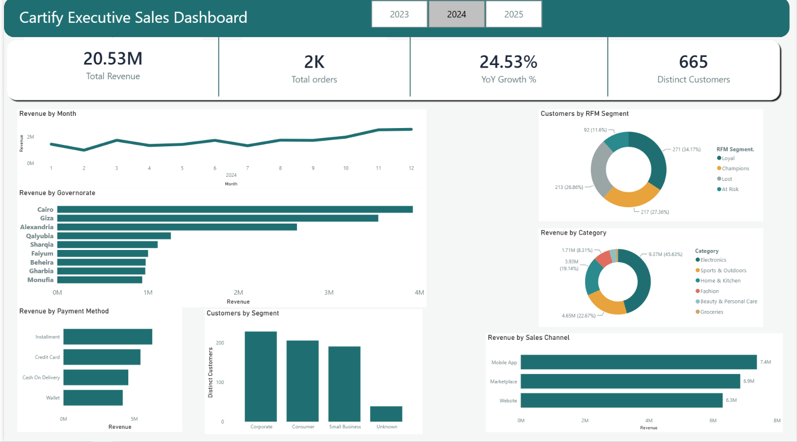

# Cartify — Sales & Customer Analytics Dashboard

An end-to-end analytics project: a deliberately messy, custom-built retail dataset,
cleaned and modeled in Power Query, analyzed in SQL Server, and visualized in an
interactive Power BI dashboard with customer segmentation and time-intelligence.



## Overview

Cartify is a fictional multi-category e-commerce retailer operating across Egypt.
Rather than using a common tutorial dataset, I designed the source data myself —
three related tables (customers, products, orders) with realistic data quality
problems (inconsistent formats, duplicates, missing values, referential integrity
violations) and genuine underlying business patterns: seasonal demand shifts,
regional concentration, category growth/decline trends, and real variation in
customer engagement.

## Tools Used

- **Power Query** — data cleaning, type correction, mixed-date-format parsing
- **SQL Server (T-SQL)** — joins, CTEs, window functions, `NTILE()`
- **Power BI / DAX** — time-intelligence measures, interactive dashboard
- **RFM Analysis** — Recency/Frequency/Monetary customer segmentation

## Workflow

1. **Clean** — Power Query: fixed inconsistent governorate names, mixed date
   formats (DD/MM vs MM/DD), currency-as-text price fields, duplicate rows,
   and orphaned foreign keys across all three tables.
2. **Model** — Loaded into SQL Server with proper primary/foreign key constraints,
   which caught orphaned rows that had slipped past the initial cleaning pass.
3. **Analyze** — Wrote SQL using joins, CTEs, and `NTILE()` to quartile-score
   every customer on Recency, Frequency, and Monetary value, then segmented them
   into Champions / Loyal / At Risk / Lost.
4. **Visualize** — Built a Power BI dashboard with DAX YoY/MoM revenue growth
   measures, category and regional breakdowns, and the RFM segmentation as an
   interactive panel.

## Key Finding

Roughly **37% of customers** scored as **At Risk or Lost** — a meaningful group
that historically ordered regularly but has gone quiet. That's a concrete,
actionable retention signal, not just a chart.

## Debugging Highlights

A few real problems came up during this project, worth calling out since fixing
them was as much a part of the work as the analysis itself:

- **A `tinyint` column silently truncated every discount value** to a whole
  number during SQL Server import — 0.10 became 0, invisibly, at the storage
  level. Traced by comparing SQL and DAX totals until they diverged, then
  isolating each component of the revenue formula individually.
- **SQL and DAX handle `NULL` differently in arithmetic** — SQL's `SUM()`
  silently drops any row where `1 - NULL` evaluates to `NULL`, while DAX
  treats a blank as 0. Missing discounts were explicitly treated as 0% in
  both, using `COALESCE()` in SQL, to make the two systems reconcile.
- **Mixed date formats** required detecting which of two numbers in a date
  string could only be a day (not a month) to disambiguate DD/MM vs MM/DD —
  and documenting the small remainder that stayed genuinely ambiguous.

## Repository Structure

```
cartify-analytics/
├── README.md
├── sql/
│   └── cartify_analysis.sql
├── powerbi/
│   └── Cartify_Dashboard.pbix
├── data/
│   ├── data_dictionary.md
│   ├── raw/
│   │   ├── customers_raw.csv
│   │   ├── products_raw.csv
│   │   └── orders_raw.csv
│   └── cleaned/
│       ├── customers_clean.csv
│       ├── products_clean.csv
│       └── orders_clean.csv
└── images/
    └── dashboard_screenshot.png
```

Both raw and cleaned versions of each table are included — the raw files show
the actual starting condition (mixed formats, duplicates, orphaned references),
and the cleaned files are the direct output of the Power Query workflow described
below.

## Data Source

Synthetic dataset, designed and generated for this project to include realistic
data quality issues and genuine business patterns (seasonality, regional
concentration, customer churn signal) rather than random noise.

---

**Author:** Ahmed El Bakry
📧 Ahmed.Ehabbakry2004@gmail.com | 🔗 [LinkedIn](https://linkedin.com/in/ahmed-ehab-20545a1ab)
